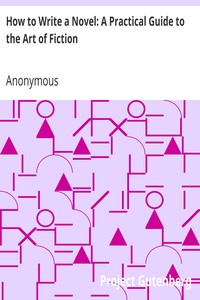

# #7 - How to Write a Novel

**Subtitle**: A Practical Guide to the Art of Fiction

**Author**: Anonymous

**Link**: [Project Gutenberg :octicons-link-external-16:][gutenberg-link]{:target=_blank}

[gutenberg-link]: https://www.gutenberg.org/ebooks/38887

**Completion**: 2026-02-07

**Recommended**: Yes

**Summary**: An anonymous—but clearly gifted—author explains the secret of writing a novel: hard work.

What makes this book refreshing is its tone. Nobody writes like this anymore. Even before you know anything about its origin, the phrasing, the rhythm, the unapologetically not-so-modern adjectives all point to an earlier era—one not far from Agatha Christie’s, if you’ve ever read her in her original, unmodernized English.

Then you stumble upon a “to‑day,” and the illusion becomes certainty. The most recent work referenced in the book is from 1898, and every author mentioned is long gone. The book isn’t trying to be something it isn't—it simply *is* of its time.

The author walks through the many moving parts of novel‑writing: the plot, the elusive idea of originality, the shaping of characters, the setting, even the writer’s own working environment (which, he warns, should not be copied from famous authors you admire). And no matter the topic, everything funnels down to one conclusion: work hard and, with a bit of luck, you might produce something good.

Success, he reminds us, does not guarantee commercial triumph—only personal satisfaction. The victory is in the doing.

A simple, charming, and unexpectedly satisfying read.

**Cover**

