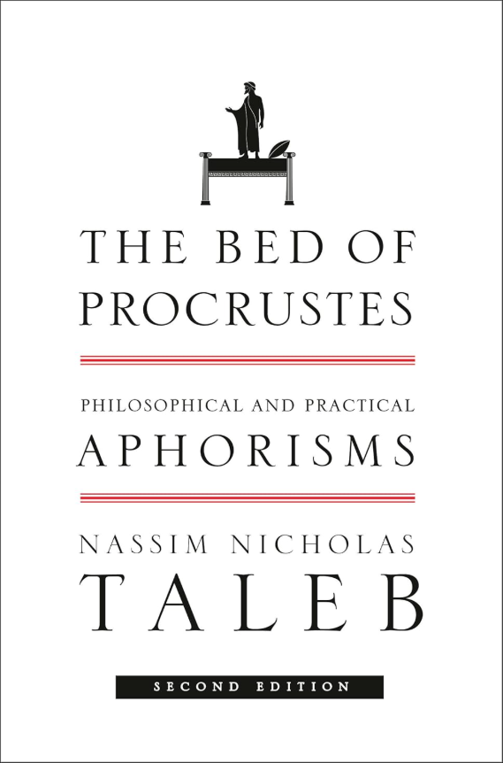

# #8 - The Bed of Procrustes

**Subtitle**: Philosophical and Practical Aphorisms

**Author**: Nassim Nicholas Taleb

**Amazon**: [Amazon.de :octicons-link-external-16:][amazon-link]{:target=_blank}

[amazon-link]: https://www.amazon.de/Bed-Procrustes-Philosophical-Practical-Aphorisms/dp/0812982401/

**Completion**: 2026-02-10

**Recommended**: No

**Summary**: *Taleb* presents a collection of thoughts (*aphorisms*) that seem to demand reverence simply because they come from *Taleb*.

Having read *“The Black Swan”* first and *“Fooled by Randomness”* afterward (yes, in reverse order), I figured it was time to continue with the next volume in *Taleb’s* universe. This book is the third in what is now retroactively labeled the *Incerto*. George Lucas once told us that the original three *Star Wars* films were actually the middle of a longer saga—he just waited twenty years to say so. If Lucas can do it, *Taleb* surely won’t be left behind.

Here’s the thing: this book has nothing to do with uncertainty. Or maybe it has everything to do with it, because it’s profoundly uncertain what the book is about or what it aims to convey. One thing, however, feels “certain”: the book was conceived as a quick money grabber.

The formula:

  - Start with an introductory chapter about *Procrustes*—the mythic character who chopped or stretched his guests to make them fit his bed, i.e., bending reality to one’s own rigid template.

  - Follow with a pile of *aphorisms*. Quantity over quality. Repetition a must. Organization unnecessary. Relationship to the chapter titles purely coincidental.

  - Close with a chapter explaining that writing a book of *aphorisms* is a challenging form, not suited for everyone—writer or reader.

Remarkably fitting: *Procrustes* made his guests fit the bed; *Taleb* has made random content fit the shape of a “book.”

I read every *aphorism*, and I still don’t know what the point was supposed to be. They feel like a scattered collection of thoughts that any adult with half a brain has had before—or read elsewhere. They seem to acquire gravitas only because they’re delivered under the *Taleb* banner.

The main through-line I extracted from these aphorisms is *Taleb’s* profound dislike for economists, journalists, academics, and—just slightly less—for businessmen.

Some *aphorisms* are repeated verbatim. Literally. And the recurrence of similar ideas across chapters reminded me of filling out a U.S. immigration form: dozens of questions asking, in subtly altered wording, whether you intend to assassinate the president. Eventually you lose track of the double, triple, and quadratic negatives and fear you’ll accidentally incriminate yourself.

I also wonder whether this book was rushed out after *Taleb* read the draft of *The Art of Thinking Clearly* by *Rolf Dobelli* (he mentions it in the text). *Dobelli’s* book uses brief logical‑fallacy “aphorisms,” one per chapter, surrounded by short narratives. It’s easy to imagine *Taleb* pushing his own aphoristic compilation to the market before *Dobelli’s** gained traction. Pure speculation.

The rushed nature shows. The early chapters contain many entries, but the volume tapers quickly to single‑page segments. Sensing the decline, the author tries to pad the final chapters, though the expansion is purely pyrrhic.

At times, I even questioned the authorship: it wouldn’t surprise me if a pair of interns were handed stacks of handwritten notes, instructed to transcribe them and generate a thousand more *aphorisms* via “research”—i.e., *Google**. We will, naturally, never know.

There is one benefit: the *aphorisms* are shallow enough that you can finish the entire thing in a single day. The author recommends reading only four per day and pondering their profundity—a suggestion that feels like an attempt to convince readers there’s actually some substance here.

**Cover**

