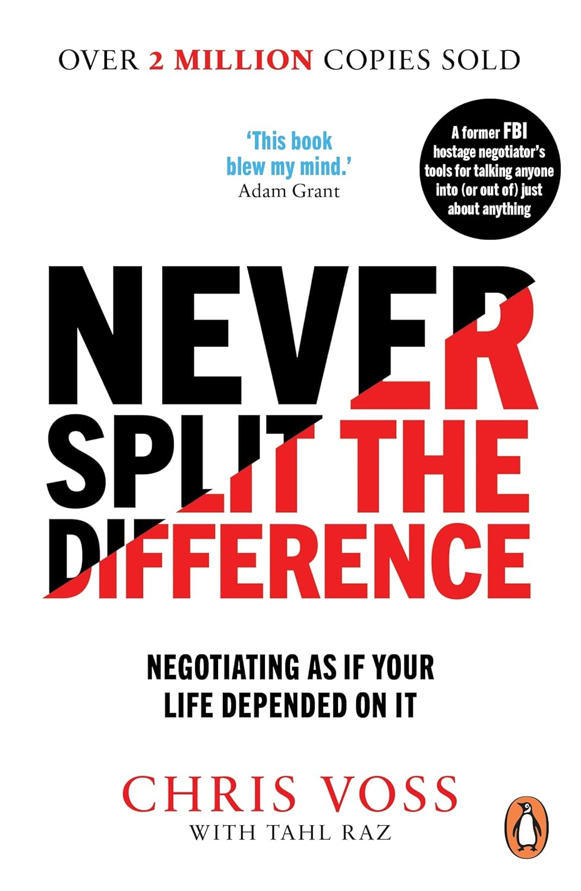

# #9 - Never Split the Difference

**Subtitle**: Negotiating as if Your Life Depended on It

**Author**: Chris Voss / Tahl Raz

**Link**: [Amazon.de :octicons-link-external-16:][amazon-link]{:target=_blank}

[amazon-link]: https://www.amazon.de/Never-Split-Difference-Negotiating-Depended/dp/1847941494/

**Completion**: 2026-02-20

**Recommended**: Yes

**Summary**: FBI retired agent *Chris Voss* takes a deep dive into negotiation techniques.

It’s an easy read, and what *Chris Voss* promises, with the editorial help of *Tahl Raz*, he actually delivers. Each chapter opens with a real action story, and from there he breaks down techniques, tactics, successes, and failures, all filtered through the lens of someone who has had to negotiate under life‑or‑death pressure.

That’s what makes the book good: real experience translated into usable insight. Unlike authors who sanitize their lessons to showcase only victories, Voss is comfortable showing failure—how he learned, how he adapted, and how those failures helped redefine practices in the negotiation world.

The title *“Never Split The Difference”* doesn’t do justice to the content. It comes from one of the exercises he uses in workshops, but the phrase barely hints at the wealth of actionable material inside. I found myself trying some of the techniques—labels and calibrated questions—when replying to a particularly persistent request for a business call. The jury is still out.

While reading, I couldn’t help thinking about *“Atomic Habits”*, James Clear’s exceptionally structured and well‑architected book. Clear lays out a framework from the start and builds methodically through rules and real‑world examples. Voss, on the other hand, moves through his rules more loosely. Only in *Chapter 9* (of 10) does something resembling a framework take shape. Useful, but not fully formalized.

**The Bad**: Yes, there’s something that rubbed me the wrong way. Throughout the book, there’s a constant reminder of Voss’s business: CEOs who hire him, CEOs who study under him, students in prestigious roles who succeeded thanks to his teachings. The commercial undertone is ever‑present. It didn’t need to be this obvious; the book’s content could stand on its own.

And yes, I understand it’s part of the sales pitch, part of the American style of self‑promotion.

But that doesn’t mean I have to like it.

**Cover**

